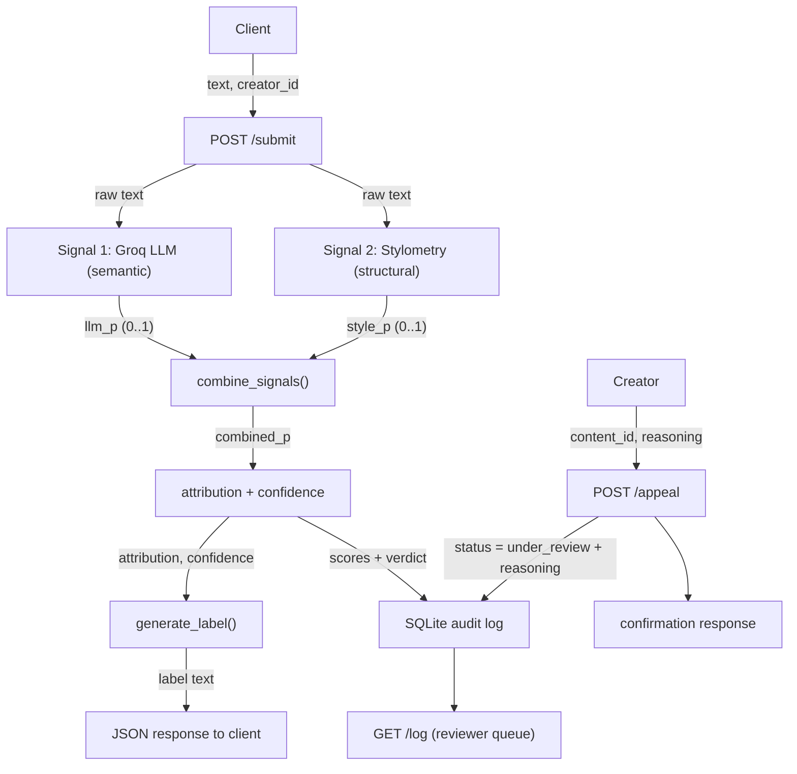

# Provenance Guard — Planning

Provenance Guard is a backend service that any creative-sharing platform can plug into
to classify submitted text as AI-generated or human-written, score its confidence in
that classification, surface a plain-language transparency label, and let creators
appeal a verdict they believe is wrong. The system is designed around one core belief:
**honest uncertainty beats a confident wrong answer**, and **falsely labeling a human's
work as AI is the worst error we can make**.

---

## Architecture

### Submission flow
A creator sends raw text + a `creator_id` to `POST /submit`. The text is fanned out to
two independent detection signals: a Groq LLM assessment (semantic) and a stylometric
heuristic (structural). Each returns a probability that the text is AI-generated. The
scorer combines them into a single calibrated probability, maps it to a verdict
(`likely_ai` / `uncertain` / `likely_human`) and a confidence number, and the label
generator turns that into reader-facing text. The full decision (both signal scores,
combined confidence, verdict) is written to the SQLite audit log, and a structured JSON
response is returned.

### Appeal flow
A creator who disputes a verdict sends the `content_id` + their reasoning to
`POST /appeal`. The system records the appeal against the original decision, flips the
content's status to `under_review`, and returns a confirmation. No automated
re-classification happens — a human reviewer picks it up from the queue (`GET /log`).



ASCII fallback:

```
                         +------------------------+
  text, creator_id  -->  |     POST /submit       |
                         +-----------+------------+
                                     |
                 raw text            |            raw text
            +------------------------+------------------------+
            v                                                 v
  +-------------------+                            +------------------------+
  | Signal 1: Groq    |                            | Signal 2: Stylometry   |
  | LLM (semantic)    |                            | (structural, pure py)  |
  +---------+---------+                            +-----------+------------+
            | llm_p (0..1)                                     | style_p (0..1)
            +------------------------+------------------------+
                                     v
                          +----------------------+
                          |  combine_signals()   |  combined_p
                          +----------+-----------+
                                     v
                     +-------------------------------+
                     | attribution + confidence      |
                     +------+-----------------+-------+
                            |                 |
              attribution,  |                 | scores + verdict
              confidence    v                 v
                  +------------------+   +------------------+
                  | generate_label() |   | SQLite audit log |<---- POST /appeal
                  +--------+---------+   +---------+--------+      (status=under_review)
                           |                       |
                           v                       v
                  +------------------+    +------------------+
                  | JSON response    |    | GET /log (queue) |
                  +------------------+    +------------------+
```

---

## 1. Detection signals

The pipeline uses **two genuinely independent signals** — one semantic, one structural.
Both output the same currency: a probability `P(AI)` in `[0, 1]`.

### Signal 1 — Groq LLM assessment (semantic coherence)
- **What it measures:** asks `llama-3.3-70b-versatile` to read the text holistically and
  judge whether it reads as human- or AI-written, returning strict JSON
  `{"ai_probability": 0.0..1.0, "rationale": "..."}`.
- **Why it differs between human and AI:** LLMs are good at recognizing the "flavor" of
  generated prose — even, hedged, list-like, thesis-driven, low-risk. It captures meaning
  and rhetorical structure that pure statistics miss.
- **Output:** `llm_p` in `[0, 1]` (plus a human-readable rationale stored for context).
- **Blind spot:** it is weakest exactly where the stakes are highest — lightly edited AI
  text, non-native-English human writing that "feels" formal/uniform, and very short
  inputs where there is too little signal. It can also be inconsistent run-to-run.

### Signal 2 — Stylometric heuristics (structural uniformity)
Pure-Python statistics; no external NLP libraries. Three sub-metrics, each normalized to
an AI-likeness sub-score in `[0, 1]`, then averaged into `style_p`:
- **Sentence-length variance (burstiness):** AI text tends to be metronomic; human text
  bursts between short and long sentences. Low variance -> higher AI-likeness.
- **Type-token ratio (vocabulary diversity):** measured over the text and length-adjusted.
  AI prose is often smoothly mid-range; extremes (very repetitive or very rich) pull toward
  human.
- **Punctuation density:** humans pepper text with dashes, ellipses, parentheses, and
  irregular punctuation; very clean, comma-and-period-only text reads more AI.
- **Why it differs:** these are measurable statistical fingerprints that don't require
  understanding meaning — orthogonal to what the LLM sees.
- **Output:** `style_p` in `[0, 1]`.
- **Blind spot:** short text (variance is meaningless on 1–2 sentences), intentionally
  repetitive human poetry (low burstiness, simple vocab -> looks AI), and formal human
  academic writing (uniform by genre -> looks AI). This is the signal most likely to
  produce a false positive, which is why it is weighted lower than the LLM.

### Combining them
`combined_p = 0.65 * llm_p + 0.35 * style_p`. The LLM is weighted higher because it is the
more semantically informed signal and its blind spots are partially covered by stylometry;
stylometry is down-weighted precisely because it is the signal most prone to false
positives on legitimate human edge cases. If Groq is unavailable, the pipeline degrades
gracefully to stylometry alone but caps confidence so it never produces a *high-confidence*
verdict on a single structural signal.

---

## 2. Uncertainty representation

`combined_p` is the probability the text is AI-generated. We translate it into a **verdict**
plus a **confidence number**, deliberately leaving a wide "uncertain" band in the middle so
the system can say *"I don't know"* instead of guessing.

What a score means to the system:
- `combined_p = 0.6` -> still **uncertain**. It leans AI, but not enough to risk a verdict.
- `combined_p = 0.5` -> maximally uncertain; we explicitly refuse to assign a verdict.

### Thresholds (asymmetric on purpose)
A false positive (calling a human's work AI) is worse than a false negative on a writing
platform, so an AI verdict requires **stronger** evidence than a human verdict:

| combined_p          | attribution    |
|---------------------|----------------|
| `>= 0.70`           | `likely_ai`    |
| `<= 0.35`           | `likely_human` |
| `0.35 < p < 0.70`   | `uncertain`    |

The AI threshold (0.70) sits further from 0.5 than the human threshold (0.35), so borderline
text falls into `uncertain` rather than being branded AI.

### Confidence number
- `likely_ai` -> `confidence = combined_p`
- `likely_human` -> `confidence = 1 - combined_p`
- `uncertain` -> `confidence` reports how *unsure* we are: `1 - 2*|combined_p - 0.5|`
  (peaks at 1.0 when `p == 0.5`), so an uncertain 0.51 reads differently from a near-verdict.

A "high confidence" label is only shown when confidence `>= 0.80`; between the verdict
threshold and 0.80 the label hedges ("our analysis leans..."). This is how 0.51 and 0.95
produce meaningfully different reader text rather than a binary flip.

---

## 3. Transparency label design

Three variants, written for a non-technical reader. `{pct}` is `round(confidence * 100)`.

| Variant | Exact text |
|---------|------------|
| **High-confidence AI** | `AI-generated (high confidence). Our analysis strongly indicates this text was produced by an AI system. This verdict is based on two independent checks: a language-model assessment and writing-style statistics. Confidence: {pct}%. AI detection is not perfect — if you wrote this yourself, you can appeal this result.` |
| **High-confidence human** | `Human-written (high confidence). Our analysis strongly indicates this text was written by a person. This verdict is based on two independent checks: a language-model assessment and writing-style statistics. Confidence: {pct}%.` |
| **Uncertain** | `Attribution uncertain. We could not confidently tell whether this text is human-written or AI-generated, so we are not assigning a verdict. This is common for short, edited, or stylistically unusual writing. The creator's authorship is not in question. (Internal signal strength: {pct}%.)` |

Notes:
- The AI label always tells the creator they can appeal — the asymmetry shows up in the UX,
  not just the math.
- The uncertain label explicitly reassures the creator ("authorship is not in question").
- When a verdict is reached but confidence `< 0.80`, the verdict text softens "strongly
  indicates" to "leans toward" while keeping the same structure.

---

## 4. Appeals workflow

- **Who can appeal:** any creator, by referencing the `content_id` from their `/submit`
  response. (In production this would be auth-gated to the content's owner.)
- **What they provide:** `content_id` and `creator_reasoning` (free text explaining why they
  believe the classification is wrong).
- **What the system does:**
  1. Looks up the original decision by `content_id` (404 if unknown).
  2. Updates that content's `status` from `classified` to `under_review`.
  3. Writes an appeal row to the audit log, linked to the original decision and storing the
     reasoning + timestamp.
  4. Returns a confirmation `{content_id, status: "under_review", message}`.
- **No automated re-classification** — the verdict is untouched; it is flagged for a human.
- **What a reviewer sees** via `GET /log`: the original verdict, both signal scores, the
  combined confidence, the creator's reasoning, and the `under_review` status — everything
  needed to make a human judgment in one place.

---

## 5. Anticipated edge cases

1. **Repetitive, simple-vocabulary human poetry.** A poem built on refrain and plain words
   has *low* sentence-length variance and *low* type-token ratio — exactly the structural
   fingerprint of AI. Stylometry will likely over-score it as AI. Mitigation: stylometry is
   weighted only 0.35, the AI threshold is high (0.70), and the wide uncertain band catches
   it — but this is the most likely false positive, and it is documented honestly.
2. **Non-native-English / very formal human writing.** Academic or ESL prose can read as
   uniform and hedged to *both* signals (the LLM associates formality with AI, stylometry
   sees low burstiness). When both signals agree wrongly, the safeguards can't fully save
   us — this is the scenario the appeals workflow exists for.
3. **Very short inputs (< ~2 sentences).** Variance and type-token ratio are statistically
   meaningless; the LLM has little to work with. The system treats short text conservatively
   and will tend to land in `uncertain` rather than commit to a verdict.

### False-positive trace
A human poet submits a refrain-heavy poem. Stylometry returns `style_p = 0.82`; the LLM,
reading meaning, returns `llm_p = 0.40`. `combined_p = 0.65*0.40 + 0.35*0.82 = 0.55` ->
falls in the **uncertain** band (not branded AI). The label reassures the creator and, had
it tipped to `likely_ai`, the AI label invites an appeal -> status flips to `under_review`
-> a human reviewer sees both scores and the divergence and can correct it. The asymmetry,
the uncertain band, and the appeal path all line up to protect the human writer.

---

## AI Tool Plan

How each implementation milestone uses this spec to prompt an AI coding tool.

### M3 — submission endpoint + first signal
- **Spec sections provided:** "Detection signals" (Signal 1) + "API contract" + the
  architecture diagram.
- **Ask the tool to generate:** the Flask app skeleton with a `POST /submit` route stub, the
  `llm_signal(text)` function (Groq call returning JSON `ai_probability`), the SQLite
  `submissions` table + insert helper, and a `GET /log` endpoint.
- **Verify:** call `llm_signal` directly on 2–3 inputs and confirm it returns a float in
  `[0,1]`; `curl` `/submit` and confirm the response shape (`content_id`, `attribution`,
  placeholder `confidence`/`label`) and that a structured row lands in the log.

### M4 — second signal + confidence scoring
- **Spec sections provided:** "Detection signals" (Signal 2) + "Uncertainty representation"
  + the diagram.
- **Ask the tool to generate:** `stylometry_signal(text)` (the three sub-metrics ->
  `style_p`) and `combine_signals()` implementing the exact weights and thresholds above.
- **Verify:** confirm the generated thresholds match the table in section 2 (AI tools often
  drift here); run the 4 calibration inputs (clear AI, clear human, formal-human,
  lightly-edited AI) and print both signal scores separately; confirm scores vary
  meaningfully and map to the right verdict bands.

### M5 — production layer
- **Spec sections provided:** "Transparency label design" + "Appeals workflow" + the diagram.
- **Ask the tool to generate:** `generate_label(attribution, confidence)` producing the
  three verbatim variants, and the `POST /appeal` endpoint (status update + appeal log row).
- **Verify:** call `generate_label` for all three verdicts and confirm the text matches this
  doc exactly; `curl` an appeal with a real `content_id` and confirm `status` flips to
  `under_review` and the reasoning appears in `GET /log`; confirm Flask-Limiter returns 429
  after the configured limit.
